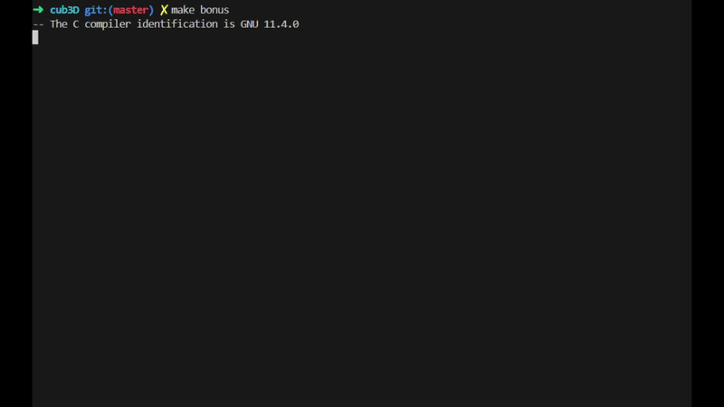
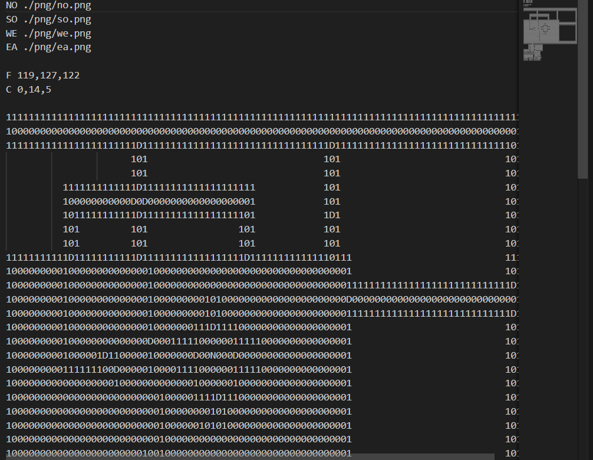

# cub3D


## 📌 Overview
**cub3D** is a graphics project at 1337 (42 Network) inspired by the legendary game Wolfenstein 3D. The objective is to create a dynamic 3D view inside a maze using the mathematical technique known as Raycasting.


This project represents a significant leap in algorithmic complexity. As a Software Engineer, this project showcases my ability to implement complex mathematics, handle real-time rendering, and manage application performance.

## 💡 Core Concepts Explored
### Raycasting
**Definition:** Raycasting is a rendering technique to create a 3D perspective in a 2D map. It works by tracing rays from the player's viewpoint and calculating intersections with walls.
**Problem Solved:** It solves the problem of rendering complex 3D environments efficiently on limited hardware by simplifying the 3D projection mathematical calculations into 2D plane intersection checks.

## 🚀 Features
- **Raycasting Engine:** Calculates distance to walls and renders a pseudo-3D environment using untextured or textured vertical slices.
- **Map Parsing:** Strictly parses `.cub` configuration files for textures, floor/ceiling colors, and the map grid.
- **Textures:** Applies custom textures to North, South, East, and West walls.
- **Movement:** Implements smooth player movement and rotation, complete with collision detection.
- **Minimap (Bonus):** Renders a 2D overhead map to show the player's position.

## 📥 How to Clone
To clone this project, use the following command:
```bash
git clone git@github.com:Anasqabbal/cub3D.git
cd cub3D
```

## 🛠️ Build & Run
To compile and execute the game, follow these steps:

1. **Build the game:**
   Run the `make` command to compile all files and generate the executable:
   ```bash
   make
   ```
   *(Note: You can compile the bonus version using `make bonus` if you want features like the minimap or doors).*



2. **Run the game:**
   Launch the game by providing the path to a map file (with the `.cub` extension):
   ```bash
   ./cub3D maps/map.cub
   ```
   *(Or running the bonus executable, `./cub3D_bonus maps/map_bonus.cub`)*

## 🗺️ Map Creation Rules
The game parses a scene configuration file (must end with the `.cub` extension) to load textures, colors, and the map grid. You can create custom maps by adhering to the following rules:

Here is an example of a valid map configuration:



### 1. Configuration Metadata
Before the map grid starts, you must specify the paths to the wall textures and the RGB colors for the floor and ceiling. Each setting must be on a new line and formatted as follows:

*   **Wall Textures:**
    *   `NO [path]` - Texture for the North wall (e.g., `./png/no.png`)
    *   `SO [path]` - Texture for the South wall (e.g., `./png/so.png`)
    *   `WE [path]` - Texture for the West wall (e.g., `./png/we.png`)
    *   `EA [path]` - Texture for the East wall (e.g., `./png/ea.png`)
*   **Colors (RGB):**
    *   `F [R],[G],[B]` - Floor color, values from 0 to 255 (e.g., `F 119,127,122`)
    *   `C [R],[G],[B]` - Ceiling color, values from 0 to 255 (e.g., `C 0,14,5`)

### 2. Map Grid Rules
The map grid must be the last section of the configuration file. It is defined using these characters:
*   `1` — Wall
*   `0` — Empty space (walkable floor)
*   `D` — Door (optional, only supported in bonus mode)
*   `N` / `S` / `E` / `W` — Player starting position and initial direction (North, South, East, or West)

#### Validation Constraints:
*   **Enclosed Map:** The map must be entirely closed and surrounded by walls (`1`). The player must not be able to walk or see into the empty void outside the map boundaries (any spaces or newlines around/within the map must be enclosed by walls).
*   **Single Player:** The map must contain exactly **one** player starting position (`N`, `S`, `E`, or `W`).
*   **Empty Lines:** There should be no empty lines inside the map grid.

## 🎮 Controls & Gameplay
Use the following controls to play:

| Key / Input | Action |
| :--- | :--- |
| **W**, **A**, **S**, **D** (or **AWSD**) | Move the player (Forward, Left, Backward, Right) |
| **Mouse / Souris** | Look around / Rotate the camera |
| **T** | Shoot / Fire |
| **R** | Reload weapon |
| **ESC** / **Cross icon** | Exit the game cleanly |


---

## 🧠 What I Learned
- In-depth understanding of trigonometry and linear algebra as applied to computer graphics.
- Real-time rendering optimization techniques.
- Advanced parsing of complex configuration files.
- Managing a complex graphical state machine in C.
- Efficient memory management: Saving memory and preventing memory leaks using a custom garbage collector to ensure smooth, lightweight performance and an easy-to-play experience without heavy gameplay stutters.

## 🤝 Need Help?
If you are facing any issues during the run, struggling with the project, or just looking for advice, don't hesitate to reach out! You can contact me directly via the links in the [Connect with me](#-connect-with-me) section.

## 🌐 Connect with me
[](https://github.com/Anasqabbal)
[](https://www.linkedin.com/in/anasqabbal/)

